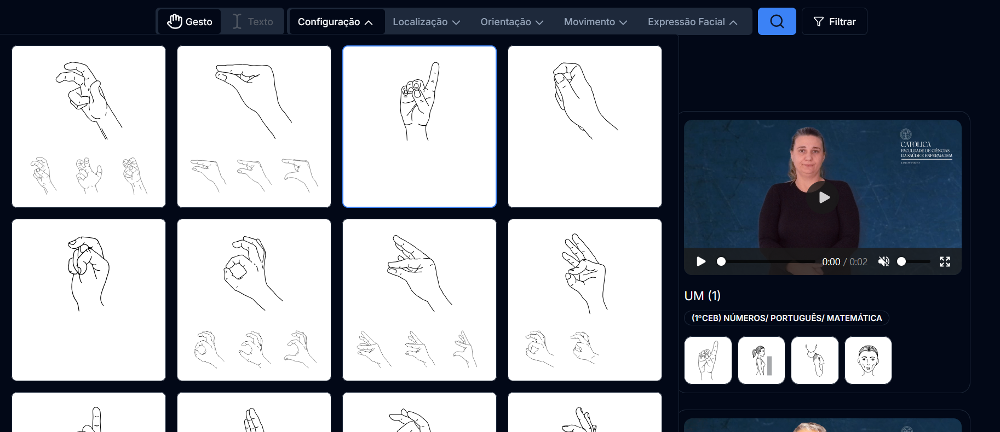

# Community / DCLGP


Community is the SvelteKit application behind DCLGP, an online platform for Lingua Gestual Portuguesa (LGP). It combines a searchable sign-language dictionary, first-cycle learning resources, and community workflows for proposing, discussing, annotating, and moderating new signs.

This work is part of the [DCitizens](https://dcitizens.eu) project, which focuses on empowering citizens with and through digital technologies.

At the time of writing, the website is deployed at [https://dclgp.dcitizens.eu/](https://dclgp.dcitizens.eu/).



## What It Does

The platform is centered on a public LGP dictionary and the workflows needed to keep it useful for a community:

- Search LGP signs by text, theme, or gesture annotation parameters.
- Browse video-based dictionary entries with metadata, comments, favorites, and regional variants.
- Provide a first-cycle dictionary focused on bilingual LGP-Portuguese learning.
- Let authenticated users propose new signs and participate in discussion through text, video comments, and voting.
- Support moderators and admins with annotation, moderation, user management, feature flags, and branding controls.
- Include optional community modules such as guides, events, docs, and a Mapbox-powered map.

## Feature Overview

| Area | Description |
| ---- | ----------- |
| Authentication | Supabase Auth handles sign-up, sign-in, user roles, profiles, avatars, and notifications. |
| Dictionary | Public LGP dictionary with video entries, themes, variants, favorites, comments, and search. |
| Gesture Search | Search by hand configuration, location, orientation, movement, and facial expression. |
| First-Cycle Dictionary | A focused dictionary for first-cycle bilingual LGP-Portuguese learning. |
| Crowdsourcing | Users can propose signs, upload videos, discuss proposals, vote, and follow proposal states. |
| Annotation | Moderators and admins can create, edit, and annotate sign entries before publication. |
| Moderation | Moderation screens cover signs, users, guides, events, and map pins. |
| Administration | Admins can manage feature flags, branding, color theme/radius, and user types. |

## Tech Stack

| Layer | Tools |
| ----- | ----- |
| App | SvelteKit, Svelte 4, TypeScript, Vite |
| UI | Tailwind CSS, shadcn-svelte style components, Bits UI, lucide-svelte |
| Forms | sveltekit-superforms, Zod |
| Backend | Supabase Auth, Supabase Postgres, Supabase Storage, Row Level Security, RPC functions |
| Media | Cloudflare R2 for sign and annotation videos |
| Maps | Mapbox GL |
| Content | mdsvex, `@sveltekit-addons/document` |
| Testing | Vitest, Playwright |

## Local Development

### Prerequisites

- Node.js and npm
- Docker
- Supabase CLI

### Environment

Create a local `.env` file with the values for your Supabase project, Cloudflare R2 bucket, and Mapbox token:

```bash
PUBLIC_SUPABASE_URL=
PUBLIC_SUPABASE_ANON_KEY=
PUBLIC_R2_PUBLIC_URL=
CLOUDFLARE_R2_ACCOUNT_ID=
CLOUDFLARE_R2_ACCESS_KEY_ID=
CLOUDFLARE_R2_SECRET_ACCESS_KEY=
PUBLIC_MAPBOX_TOKEN=
```

`PUBLIC_MAPBOX_TOKEN` is read by `src/routes/map/_components/mapbox.ts`.

### Supabase

Install the Supabase CLI and Docker, then start the local Supabase stack:

```bash
npx supabase start
```

### Install And Run

```bash
npm install
npm run dev -- --open
```

### Checks

```bash
npm run check
npm run lint
npm run test:unit
npm run test:integration
```

## Deployment

The app uses SvelteKit with `adapter-auto`, so it can be deployed to any supported SvelteKit host. The intended production services are Supabase for auth, database, and storage, plus Cloudflare R2 for sign video storage.

Before deploying:

1. Configure all required environment variables in the host.
2. Apply the Supabase migrations, RLS policies, storage buckets, and RPC functions to the target project.
3. Configure the Cloudflare R2 bucket used by the upload flows.
4. Build the app:

```bash
npm run build
```

Preview the production build locally when needed:

```bash
npm run preview
```

## License

This project is licensed under the MIT License. See [LICENSE](LICENSE) for details.

## Contributors

<a href="https://github.com/xergg"></a>

## Maintenance

This repository is an archive of the work I did on the project as the original developer. It is not the active deployment repository and will not be updated further by me as I am no longer involved with the project. Active work should be followed at [Interactive-Technologies-Institute/community_lgp](https://github.com/Interactive-Technologies-Institute/community_lgp).

Questions about the project should be sent to DCitizens at [community@dcitizens.eu](mailto:community@dcitizens.eu) or to ITI/LARSyS at [admin@iti.larsys.pt](mailto:admin@iti.larsys.pt).
